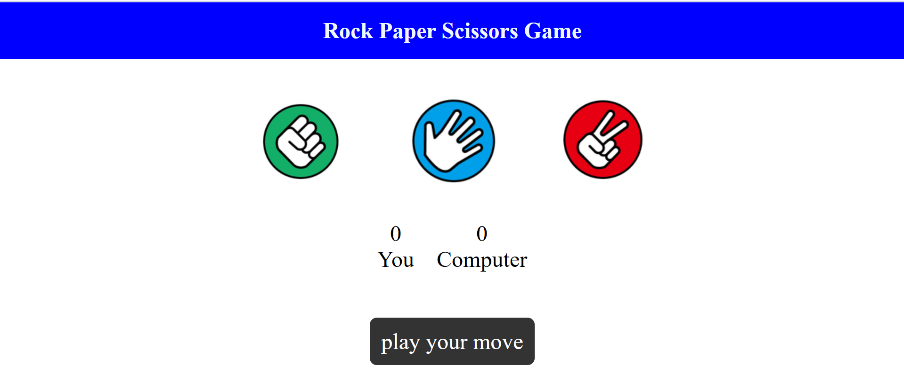

# 🪨 Rock Paper Scissors ✂️

A simple and fun **Rock-Paper-Scissors** game built using **HTML**, **CSS**, and **JavaScript**. Challenge the computer, test your luck, and track your score!

---

## 🎮 Features

- 🔁 Play against the computer
- 📈 Score tracking for both player and computer
- 💬 Real-time feedback messages (Win/Lose/Draw)
- 🎨 Clean and minimal UI
- 📱 Responsive design (works on mobile too!)

---

## 🧑‍💻 Technologies Used

- HTML5
- CSS3
- JavaScript (DOM Manipulation)

---

## 📸 Screenshots

You can take a screenshot of your game screen and upload it as `screenshot.png`, then add:

